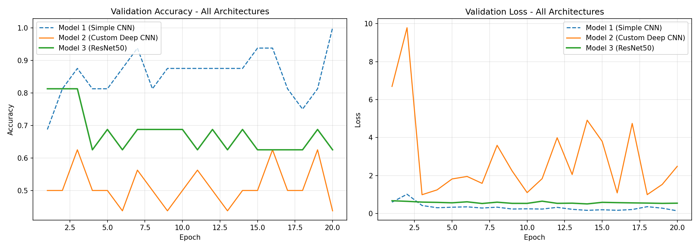
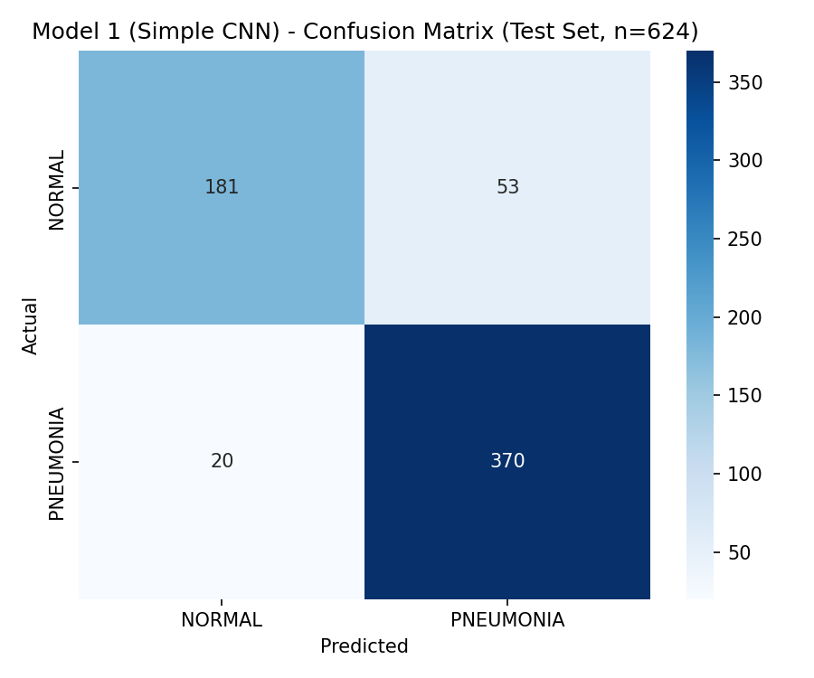
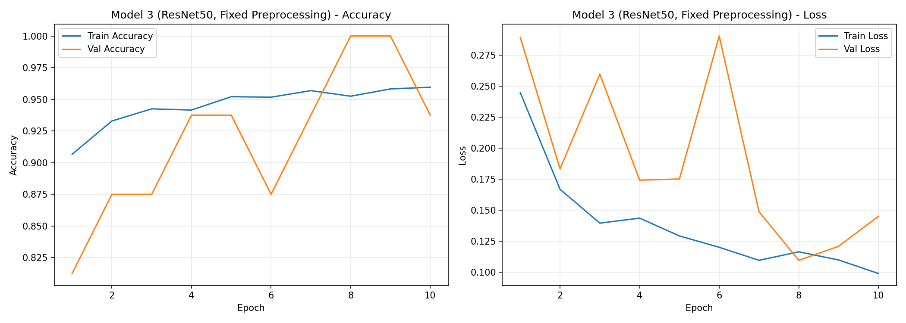

# Chest X-Ray Pneumonia Classification (CNN)

A deep learning project comparing multiple CNN architectures — a simple
custom CNN, a deeper custom CNN, and a ResNet50 transfer learning model —
for classifying pediatric chest X-rays as **NORMAL** or **PNEUMONIA**,
with an emphasis on clinically meaningful evaluation, not just accuracy.

## Project Goal

Build and rigorously compare several CNN architectures on a real medical
imaging task, using clinically relevant metrics (sensitivity,
specificity) rather than accuracy alone, and document what worked, what
failed, and why — including two intentional dead-ends that turned out to
be informative.

## Dataset

- **Source:** [Chest X-Ray Images (Pneumonia)](https://www.kaggle.com/datasets/paultimothymooney/chest-xray-pneumonia) — Kaggle, by Paul Mooney
- Pediatric chest X-rays (ages 1-5) from a single medical center (Guangzhou Women and Children's Medical Center)
- **Class distribution:**

| Split | NORMAL | PNEUMONIA | Total |
|---|---|---|---|
| Train | 1,341 | 3,875 | 5,216 |
| Validation | 8 | 8 | 16 |
| Test | 234 | 390 | 624 |

- **Note on the validation split:** the dataset's original `val` folder
  contains only 16 images. This was used as-is (rather than creating a
  custom stratified split) to stay consistent with how this dataset is
  commonly used as a benchmark. Because of its size, a single
  misclassified image swings validation accuracy by ~6%, so validation
  curves in this project are noisy by construction — **all final
  performance conclusions are drawn from the 624-image test set**, not
  the validation curves.
- Class imbalance (train has ~3x more PNEUMONIA than NORMAL) was
  addressed with `class_weight='balanced'` during training for all
  three architectures.

## Methodology

- **Framework:** TensorFlow / Keras
- **Image size:** 150x150
- **Augmentation:** mild rotation, width/height shift, zoom.
  Horizontal flip was deliberately **not** used — a chest X-ray is
  anatomically asymmetric (heart position, etc.), so flipping could
  teach the model incorrect spatial patterns.
- **Training policy:** all first training runs used a **fixed 20
  epochs with no early stopping**, so the full training curve
  (including any overfitting behavior) could be observed and
  interpreted, rather than being cut off automatically.

## Architectures

| # | Architecture | Total Params | Trainable Params | Key Idea |
|---|---|---|---|---|
| 1 | Simple CNN | 10,636,481 | 10,636,481 | Baseline: 2 Conv blocks + Flatten + Dense |
| 2 | Custom Deep CNN | 110,785 | 110,337 | 3 Conv blocks, BatchNorm, Dropout between blocks, GlobalAveragePooling2D instead of Flatten |
| 3 | ResNet50 (transfer learning) | 23,850,113 | 262,401 | Frozen ImageNet-pretrained backbone + custom classifier head |

**Design rationale for Architecture 2:** Architecture 1's Flatten layer
produced an 82,944-length vector feeding a single Dense(128) layer,
which alone accounted for nearly all of the model's ~10.6M parameters —
meaning the classifier head, not the convolutional feature extractor,
was doing almost all the "work" parameter-wise. Architecture 2 tests
whether a deeper but far smaller network (GlobalAveragePooling2D instead
of Flatten, ~96x fewer parameters) can still learn effectively.

## Results (Test Set, n=624)

| Architecture | Accuracy | Sensitivity (Recall) | Specificity |
|---|---|---|---|
| Model 1 — Simple CNN | 88.30% | 94.87% | 77.35% |
| Model 2 — Custom Deep CNN | 47.12% | 19.23% | 93.59% |
| **Model 3 — ResNet50 (fixed preprocessing)** | **91.51%** | **97.44%** | **81.62%** |

*Sensitivity is the primary metric of interest here: in a screening
context, a false negative (a missed pneumonia case) is more costly than
a false positive (an unnecessary follow-up).*





## Key Findings

### 1. Model 2 (custom deep CNN) failed, and that failure is informative

Despite following several "best practice" design choices (BatchNorm,
Dropout, GlobalAveragePooling2D), Model 2 collapsed to 47% accuracy and
19% sensitivity — worse than always predicting the majority class. The
likely cause is the interaction between aggressive parameter reduction
(~96x fewer parameters than Model 1), dropout placed between every conv
block, and the `class_weight` correction, which together appear to have
prevented the model from converging properly within 20 epochs.
**Conclusion: textbook architectural choices do not guarantee better
results without careful, empirical tuning.**

### 2. Model 3's first run failed due to a preprocessing mismatch, not the architecture

The first ResNet50 run plateaued at 63-69% validation accuracy despite
using a state-of-the-art pretrained backbone. The cause: images were
normalized with a generic `rescale=1./255` instead of ResNet50's
expected ImageNet-statistic normalization
(`tf.keras.applications.resnet50.preprocess_input`). Since the backbone
was frozen (trained on ImageNet-normalized inputs), feeding it
differently-scaled images degraded the extracted features regardless of
how well the classifier head was trained on top of them.

After correcting the preprocessing pipeline, validation accuracy rose
from a 63-69% plateau to a range of 81-100%, and test set performance
became the best of all three architectures. **Conclusion: pretrained
weights are tied to the preprocessing pipeline they were trained with —
reusing a generic rescale silently degrades transfer learning
performance without raising any errors.**

## Uncertainty Estimation (Monte Carlo Dropout)

To avoid treating every prediction as equally reliable, Model 3 uses MC
Dropout at inference: 30 stochastic forward passes (with dropout kept
active) per image, producing both a mean prediction and a standard
deviation (uncertainty).

On a sample test batch, predictions with confidence above 90%
consistently had low uncertainty (std < 0.1), while predictions near the
50% decision boundary (confidence 52-86%) were correctly flagged as
high-uncertainty (std > 0.15) — these are the cases most worth routing
to a radiologist rather than trusting the model directly.

**Limitation:** uncertainty estimation is not a safety guarantee. In the
sample batch, one misclassified image had low uncertainty (std = 0.053)
despite being wrong. High confidence and low uncertainty reduce, but do
not eliminate, the risk of a confident error.

## Clinical Interpretation & Limitations

- Model 3's 97.44% sensitivity makes it reasonably suited as a
  **first-pass screening aid** — it misses very few true pneumonia
  cases. Its 81.62% specificity means roughly 1 in 5 healthy patients
  would be flagged for unnecessary follow-up, a defensible trade-off for
  a screening (not diagnostic) tool.
- **This dataset is from pediatric patients (ages 1-5) at a single
  medical center in Guangzhou, China.** None of these models have been
  validated on adult patients, other imaging equipment, or other
  populations, and none of them should be used as an actual diagnostic
  tool.
- A PNEUMONIA prediction should still be confirmed by a radiologist
  (PPV < NPV across models); a NORMAL prediction is comparatively more
  reliable on its own.

## Interactive Dashboard

A Gradio dashboard lets you upload a chest X-ray and get a
PNEUMONIA/NORMAL prediction from Model 3 (ResNet50), along with an MC
Dropout uncertainty estimate — predictions near the decision boundary
are flagged as "high uncertainty" and recommended for radiologist
review rather than being trusted outright.

**⚠️ Educational/portfolio project only — not a diagnostic tool.**

### Run directly with Python

```bash
pip install -r requirements.txt
python app.py
```

Then open `http://localhost:8860` in your browser.

### Run with Docker

```bash
docker build -t pneumonia-classifier .
docker run -p 8860:8860 pneumonia-classifier
```

Then open `http://localhost:8860` in your browser.

*(Port 8860 is used instead of Gradio's default 7860 to avoid clashing
with other local projects; change the left-hand side of `-p` if you
need a different host port.)*

## Repository Structure

```
pneumonia-xray-classification/
├── app.py                 # Gradio dashboard
├── Dockerfile
├── requirements.txt
├── notebook/
│   └── pneumonia_cnn_classification.ipynb
├── images/
├── models/
│   └── model_3.keras      # required for the dashboard to run
└── README.md
```

## Future Work

- Grad-CAM visualization to confirm the model attends to clinically
  relevant lung regions
- Fine-tuning (unfreezing) the ResNet50 backbone at a low learning rate
  as a further experiment